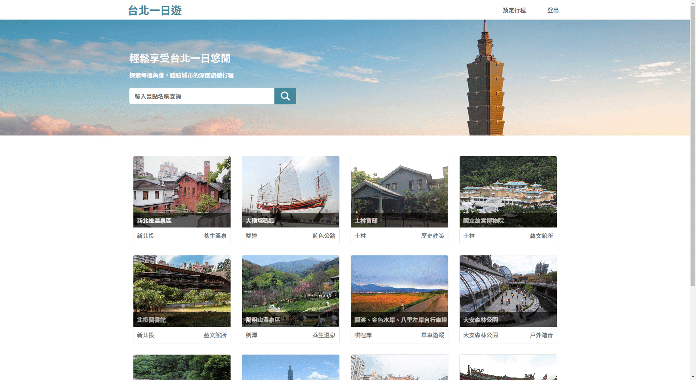

# [Taipei Day Trip 台北一日遊](https://taipei-day-trip.fastrade.store/)

Taipei Day Trip is a E-Commerce website that provides users with the ability to compare and book one-day travel itinerary.

🔗Website URL: https://taipei-day-trip.fastrade.store/

Test Account:
| Account | Password |
| --------------- | -------- |
| test@test.com | test1234 |

Test Card:
| Card number | Expiry | CVC |
| --------------- | -------- | -------- |
| 4242 4242 4242 4242 | 01/24 | 123 |

## :point_down:Table of Contents

- [Main Features](#point_downmain-features)
- [Backend Technique](#point_downbackend-technique)
  - [Infrastructure](#infrastructure)
  - [Environment](#environment)
  - [Database](#database)
  - [Cloud Services(AWS)](#cloud-servicesaws)
  - [Version Control](#version-control)
  - [Networking](#networking)
- [Architecture](#point_downarchitecture)
- [Database Schema](#point_downdatabase-schema)
- [Contact](#point_downcontact)

## :point_down:Main Features

- Use JWT for member authentication.
- Online payment system with [Tappay](https://github.com/TapPay).
- Use keyword to search for related attractions.

  

- Responsive Web Design.

  

- Infinite scroll/lazy loading.

  

- Image carousel

  

## :point_down:Backend Technique

### Infrastructure

- Docker
- Docker Compose

### Environment

- Python/Flask

### Database

- MySQL(normalize the database to 3NF)

### Cloud Services(AWS)

- EC2

### Version Control

- Git/GitHub

### Networking

- HTTP & HTTPS
- Domain Name System (DNS)
- NGINX
- SSL (SSL for Free)

## :point_down:Architecture

## :point_down:Database Schema
  
  

## :point_down:Contact

👩‍💻Wei-Han, Wang
 

:email:Email: s13602507586@gmail.com
